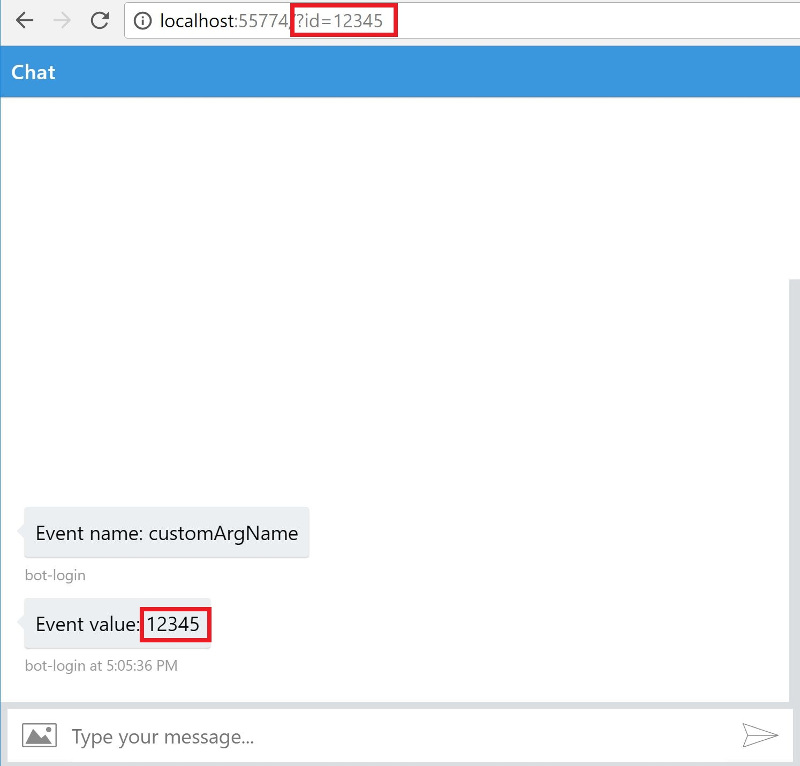

# Bot Framework WebChat with custom parameters

Bot Framework WebChat that allows custom parameters via [Direct Line API](https://docs.microsoft.com/en-us/bot-framework/rest-api/bot-framework-rest-direct-line-3-0-concepts), based on the official WebChat [Backchannel](https://github.com/Microsoft/BotFramework-WebChat#the-backchannel).

It is useful for scenarios where the behavior of the bot conversation depends on specific parameters (like tokens and client IDs), specially if there is an integration between chat bots and web apps or REST services.

The repo has the following folders:

- **core:** Contains the core JavaScript component (`webchat.js`) and an HTML sample.

```html
<body>
    <div id="botChat"></div>
</body>
<script src="https://cdn.botframework.com/botframework-webchat/latest/botchat.js"></script>
<script src="webchat.js"></script>
<script>
    var params = {
        userId: 'userid',
        username: 'you',
        botId: '<YOUR_BOT_ID>',
        botName: '<YOUR_BOT_NAME>',
        targetElement: 'botChat', // html element where the webchat gets rendered
        secret: '<YOUR_WEBCHAT_SECRET>',
        myCustomArg: '<YOUR_CUSTOM_ARG>'
    };
    
    new WebChat(params).loadApplication();
</script>
```
- **samples/aspnet-core:** An ASP.NET Core MVC sample that sends a page route parameter (ID) to a WebChat.



# Microsoft OSS Code Of Conduct Notice #

This project has adopted the [Microsoft Open Source Code of Conduct](https://opensource.microsoft.com/codeofconduct/). For more information see the [Code of Conduct FAQ](https://opensource.microsoft.com/codeofconduct/faq/) or contact [opencode@microsoft.com](mailto:opencode@microsoft.com) with any additional questions or comments.